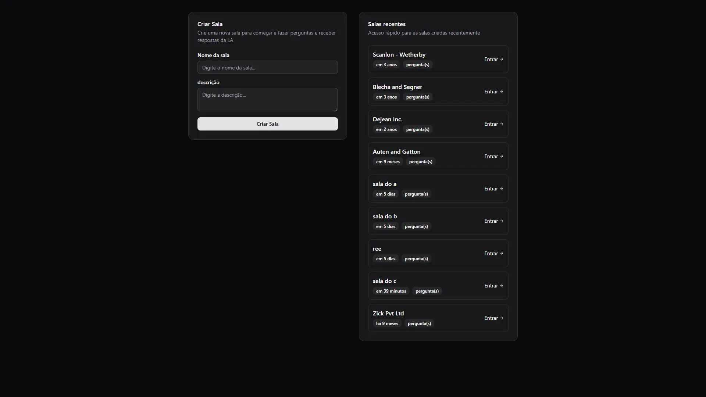
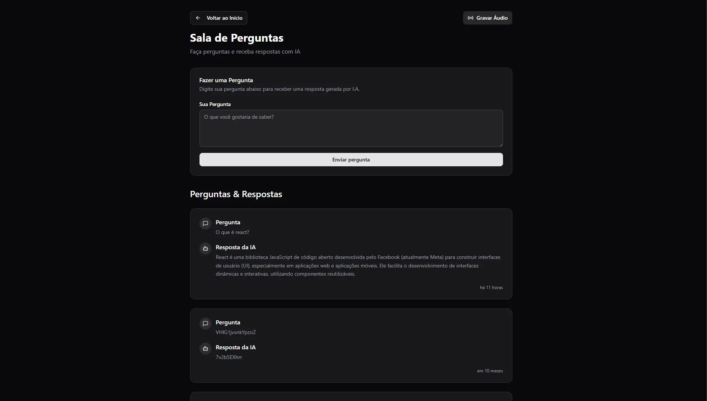
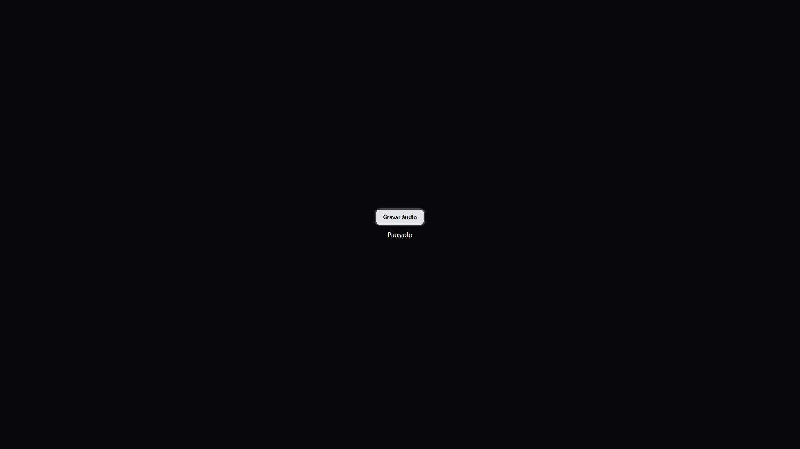
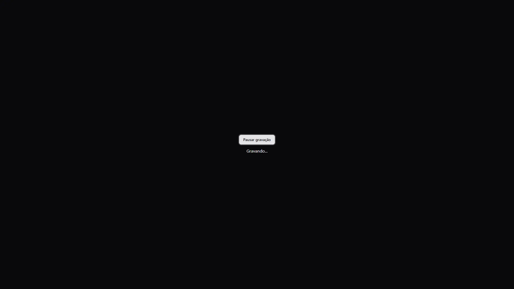

# 🚀🤖 NLW Agents - Sua IA de Perguntas e Respostas

> **Projeto desenvolvido durante o evento [NLW (Next Level Week)](https://nextlevelweek.com/) da [Rocketseat](https://rocketseat.com.br/)**


<h3 align="center">Status: 🚀 Finished</h3>

<p  align="center">
  
  
  
  
  
</p>

# Índice

- [Instalar](#🚀-como-instalar-e-executar)
- [Preview](#🖼️-preview)
- [Como usar](#📖-como-usar)
- [Estrutura do rojeto](#🏗️-estrutura-do-projeto)

## 🎯 O que é o NLW Agents?

Imagine ter uma IA que entende suas perguntas em português e responde de forma inteligente! 🧠✨

O **NLW Agents** é uma aplicação web que permite:
- 📝 Criar salas de perguntas
- 🎤 Gravar áudio com suas dúvidas
- 🤖 Receber respostas inteligentes da IA (Google Gemini)
- 💬 Fazer perguntas por texto também

É como ter um assistente virtual personalizado que entende português e está sempre pronto para ajudar! 🎉

## 🛠️ Tecnologias Utilizadas

### Backend
- **Node.js** + **TypeScript** - Para robustez e tipagem
- **Fastify** - Framework web rápido e eficiente
- **Docker** - Containerização do banco de dados
- **Drizzle ORM** - Para gerenciamento do banco de dados
- **PostgreSQL** + **pgvector** - Banco de dados com suporte a vetores
- **Google Gemini AI** - IA para processamento de perguntas
- **Zod** - Validação de dados

### Frontend
- **React 19** - Interface moderna e reativa
- **Tailwind CSS** - Estilização moderna
- **Shadcn/ui** - Sistema de componentes
- **TypeScript** - Código tipado e seguro
- **Lucide React** - Biblioteca de ícones
- **Vite** - Build tool super rápido
- **React Hook Form** - Formulários eficientes
- **TanStack** - Gerenciamento de estado do servidor

## 🖼️ Preview

<div>
  
  
</div>

<div style="display: flex;">
  
  
</div>


## 🚀 Como Instalar e Executar

### Pré-requisitos
- [Node.js](https://nodejs.org/) (versão 18 ou superior)
- [Docker](https://www.docker.com/) e [Docker Compose](https://docs.docker.com/compose/)
- [Git](https://git-scm.com/)


### 1️⃣ Clone o repositório
```bash
git clone https://github.com/silvapedrodev/nlw-agensts.git
cd nlw-agents
```

### 2️⃣ Configure o banco de dados
```bash
# Entre na pasta do servidor
cd server

# Inicie o PostgreSQL com Docker
docker-compose up -d

# Aguarde alguns segundos para o banco inicializar
```

### 3️⃣ Configure as variáveis de ambiente
```bash
# No diretório server/, crie um arquivo .env
cp .env.example .env  # se existir
# ou crie manualmente:

# Adicione sua chave da Google Gemini AI
GOOGLE_GEMINI_API_KEY=sua_chave_aqui
```

> 💡 **Como obter a chave da Google Gemini AI:**
> 1. Acesse [Google AI Studio](https://makersuite.google.com/app/apikey)
> 2. Crie uma nova API key
> 3. Cole no arquivo `.env`

### 4️⃣ Instale as dependências do servidor
```bash
# No diretório server/
npm install
```

### 5️⃣ Execute as migrações do banco
```bash
# No diretório server/
npm run db:migrate
```

### 6️⃣ Inicie o servidor
```bash
# No diretório server/
npm run dev
```

### 7️⃣ Configure o frontend
```bash
# Em outro terminal, vá para a pasta web/
cd ../web

# Instale as dependências
npm install

# Inicie o servidor de desenvolvimento
npm run dev
```

### 8️⃣ 🎉 Pronto! Acesse a aplicação
- **Frontend:** http://localhost:5173
- **Backend:** http://localhost:3333

## 📖 Como Usar

### 1. Criar uma Sala
- Acesse a página inicial
- Clique em "Criar Nova Sala"
- Digite um nome para sua sala
- Clique em "Criar Sala"

### 2. Fazer Perguntas
- **Por texto:** Digite sua pergunta e clique em "Enviar"
- **Por áudio:** Clique em "Gravar Áudio" e fale sua pergunta

### 3. Ver Respostas
- As respostas aparecem automaticamente na lista
- Cada resposta mostra a pergunta, resposta da IA e timestamp

## 🎯 Funcionalidades Principais

### ✨ Interface Moderna
- Design feito com shadcn UI
- Tema escuro por padrão
- Animações suaves

### 🎤 Gravação de Áudio
- Gravação direta no navegador
- Processamento de áudio em português
- Transcrição automática

### 🤖 IA Inteligente
- Integração com Google Gemini
- Respostas contextualizadas
- Suporte completo ao português

### 💾 Persistência de Dados
- Banco PostgreSQL robusto
- Migrações automáticas
- Dados organizados por salas

## 🏗️ Estrutura do Projeto

```
nlw-agents/
├── server/                 # Backend Node.js + Fastify
│   ├── src/
│   │   ├── db/           # Configuração do banco
│   │   ├── http/         # Rotas da API
│   │   └── services/     # Serviços (IA, etc.)
│   ├── docker-compose.yml
│   └── package.json
├── web/                   # Frontend React + Vite
│   ├── src/
│   │   ├── components/   # Componentes React
│   │   ├── pages/        # Páginas da aplicação
│   │   └── http/         # Hooks para API
│   └── package.json
└── README.md
```

## 🛠️ Scripts Úteis

### Backend (pasta `server/`)
```bash
npm run dev          # Desenvolvimento com hot reload
npm run start        # Produção
npm run db:generate  # Gerar migrações
npm run db:migrate   # Executar migrações
npm run db:seed      # Popular banco com dados
```

### Frontend (pasta `web/`)
```bash
npm run dev          # Desenvolvimento
npm run build        # Build para produção
npm run preview      # Preview do build
```

## 🤝 Contribuindo

1. Faça um fork do projeto
2. Crie uma branch para sua feature (`git checkout -b feature/AmazingFeature`)
3. Commit suas mudanças (`git commit -m 'Add some AmazingFeature'`)
4. Push para a branch (`git push origin feature/AmazingFeature`)
5. Abra um Pull Request

## 📝 Licença

Este projeto foi desenvolvido durante o evento NLW da Rocketseat. Sinta-se livre para usar, modificar e distribuir!

## 🙏 Agradecimentos

- **Rocketseat** - Pelo evento incrível e conhecimento compartilhado
- **Comunidade NLW** - Pela energia e colaboração

---

<div align="center">
  <p>Feito com ❤️ durante o NLW da <a href="https://rocketseat.com.br">Rocketseat</a></p>
  <p>🚀 Next Level Week - Agents | 2025</p>
</div> 